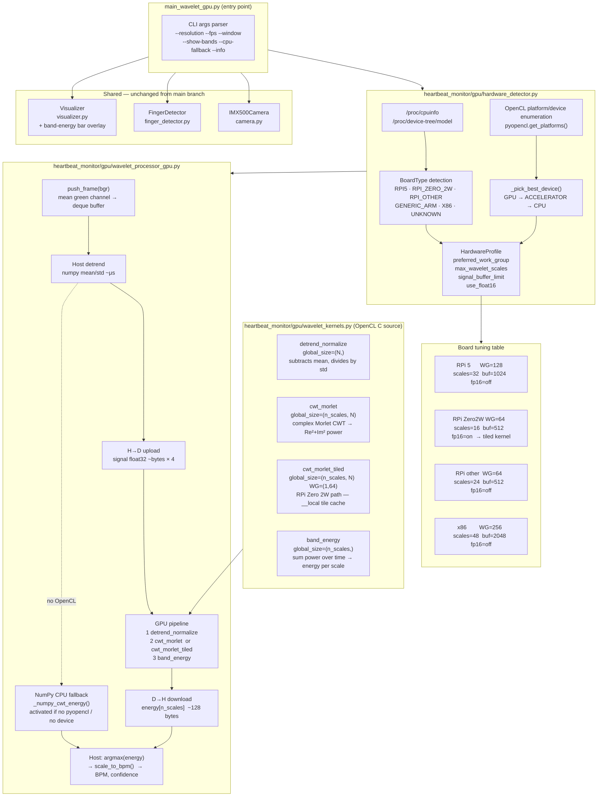

# GPU Wavelet Heartbeat Monitor – Architecture

OpenCL-accelerated pipeline on branch `feature/gpu-wavelet-opencl`.



## Pipeline description

### Per-frame data flow

```
push_frame(bgr)  →  extract mean green channel  →  rolling deque
        │
        ▼  (every 3rd frame, once min_samples reached)
Host: numpy detrend  (subtract mean, divide std)          ~μs
        │
        ▼
H → D  upload float32 signal                              ~N × 4 bytes
        │
        ├─ GPU kernel 1: detrend_normalize   global=(N,)
        │
        ├─ GPU kernel 2: cwt_morlet          global=(n_scales, N)
        │       or       cwt_morlet_tiled    global=(n_scales, N)  WG=(1,64)
        │                                   [RPi Zero 2W local-mem path]
        │
        └─ GPU kernel 3: band_energy         global=(n_scales,)
                │
                ▼
D → H  download energy[n_scales]                          ~n_scales × 4 bytes
        │
        ▼
Host: argmax(energy) → scale_to_bpm() → BPM + confidence  ~μs
```

### OpenCL kernels

| Kernel | Global size | Purpose |
|--------|-------------|---------|
| `detrend_normalize` | `(N,)` | Parallel subtract mean, divide std-dev |
| `cwt_morlet` | `(n_scales, N)` | One work-item per `(scale, time)`: computes complex Morlet CWT power `Re² + Im²` |
| `cwt_morlet_tiled` | `(n_scales, N)` WG `(1, 64)` | RPi Zero 2W variant: loads signal tile into `__local` memory to reduce global memory pressure |
| `band_energy` | `(n_scales,)` | Sum power over all time positions for each scale → scalar energy |

### Hardware tuning

| Board | WG size | CWT scales | Buffer (samples) | fp16 | Kernel |
|-------|---------|-----------|-----------------|------|--------|
| Raspberry Pi 5 (VideoCore VII) | 128 | 32 | 1024 | off | standard |
| Raspberry Pi Zero 2W (VideoCore VI) | 64 | 16 | 512 | on | **tiled** |
| Raspberry Pi other (3B / 4B) | 64 | 24 | 512 | off | standard |
| Generic ARM | 128 | 32 | 1024 | off | standard |
| x86 desktop | 256 | 48 | 2048 | off | standard |

### Graceful degradation

If `pyopencl` is not installed or no OpenCL platform is available the processor
falls back automatically to `_numpy_cwt_energy()` — the same Morlet CWT
algorithm implemented in pure NumPy.  The public API is identical in both paths.

## Running

```bash
# Print hardware/OpenCL detection report
./run_wavelet_gpu.sh --info

# Live window with GPU acceleration
./run_wavelet_gpu.sh

# Add band-energy histogram overlay
./run_wavelet_gpu.sh --show-bands

# Force CPU-only (no OpenCL required)
./run_wavelet_gpu.sh --cpu-fallback

# Headless, log BPM to stdout
./run_wavelet_gpu.sh --headless

# Record annotated video
./run_wavelet_gpu.sh --save output.mp4
```
